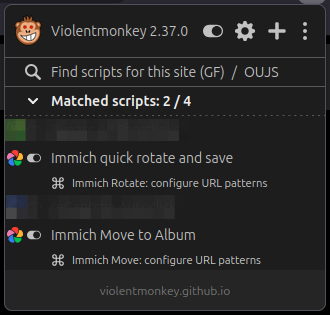
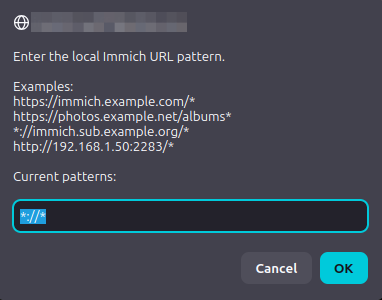

# User Scripts

This repository contains browser userscripts (mainly for Immich). More scripts will be added over time.

## What Is Violentmonkey / Tampermonkey?

Violentmonkey and Tampermonkey are browser extensions that let you install and run custom JavaScript userscripts on websites.

- Use **Violentmonkey** if you want a fully open-source manager.
- Use **Tampermonkey** if you prefer that workflow; both can install scripts from this repo.

## Install a Userscript Manager

Install **one** extension for your browser:

- Firefox:
  - Violentmonkey: <https://addons.mozilla.org/firefox/addon/violentmonkey/>
  - Tampermonkey: <https://addons.mozilla.org/firefox/addon/tampermonkey/>
- Chrome:
  - Tampermonkey: <https://chromewebstore.google.com/detail/tampermonkey/dhdgffkkebhmkfjojejmpbldmpobfkfo>
- Edge:
  - Tampermonkey: <https://microsoftedge.microsoft.com/addons/detail/tampermonkey/iikmkjmpaadaobahmlepeloendndfphd>

## Install Scripts From This Repo

1. Install Violentmonkey or Tampermonkey.
2. Click one of the **Raw install links** below.
3. Your userscript extension opens an install page.
4. Click **Install** (or **Confirm installation**).

## Add Your Own Custom Userscripts

1. Open the extension dashboard:
   - Violentmonkey: extension icon -> **plus** / **Create a new script**
   - Tampermonkey: extension icon -> **Create a new script...**
2. Paste your userscript code (including `// ==UserScript==` metadata block).
3. Save.
4. Refresh the target page and test.

## Configure Allowed Immich URL/IP Pattern

Both Immich scripts include a menu command to set allowed URL patterns (for local domains/IPs).

1. Open the script manager menu from the browser toolbar.
2. Choose the relevant script command:
   - `Immich Move: configure URL patterns`
   - `Immich Rotate: configure URL patterns`
3. Enter pattern, for example:
   - `http://192.168.1.50:2283/*`
   - `https://immich.example.com/*`

### Script Menu Screenshot

### URL/IP Configuration Popup Screenshot

This popup is where you enter your Immich URL/IP pattern.

## Available Scripts

### Immich Move to Album

- File: `immich/move-to-album.js`
- Tested Immich version: 2.7.5
- Raw install link: <https://raw.githubusercontent.com/AnonTester/user-scripts/main/immich/move-to-album.user.js>
- What it does: moves selected/current asset(s) to another album via Immich's native add-to-album modal, then removes them from the current album.
- Usage: press `m` or click the floating **Move** button.

### Immich Quick Rotate and Save

- File: `immich/rotate.js`
- Tested Immich version: 2.7.5
- Raw install link: <https://raw.githubusercontent.com/AnonTester/user-scripts/main/immich/rotate.user.js>
- What it does: rotates the current photo and saves immediately.
- Usage: `R` rotates clockwise, `Shift+R` rotates counterclockwise, or use the on-screen rotate overlay buttons.
